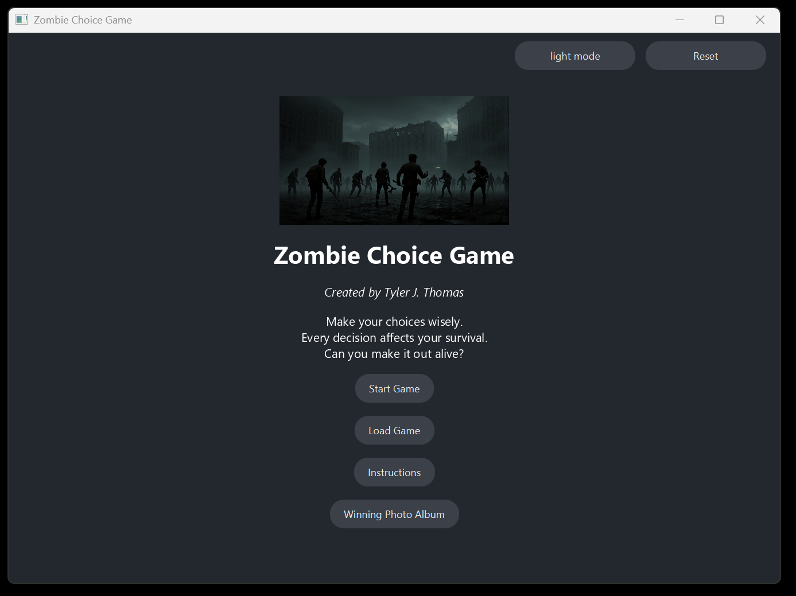
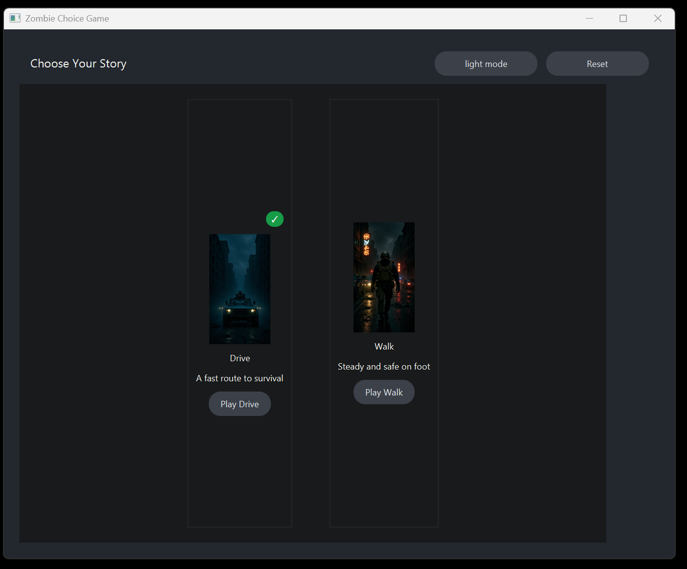
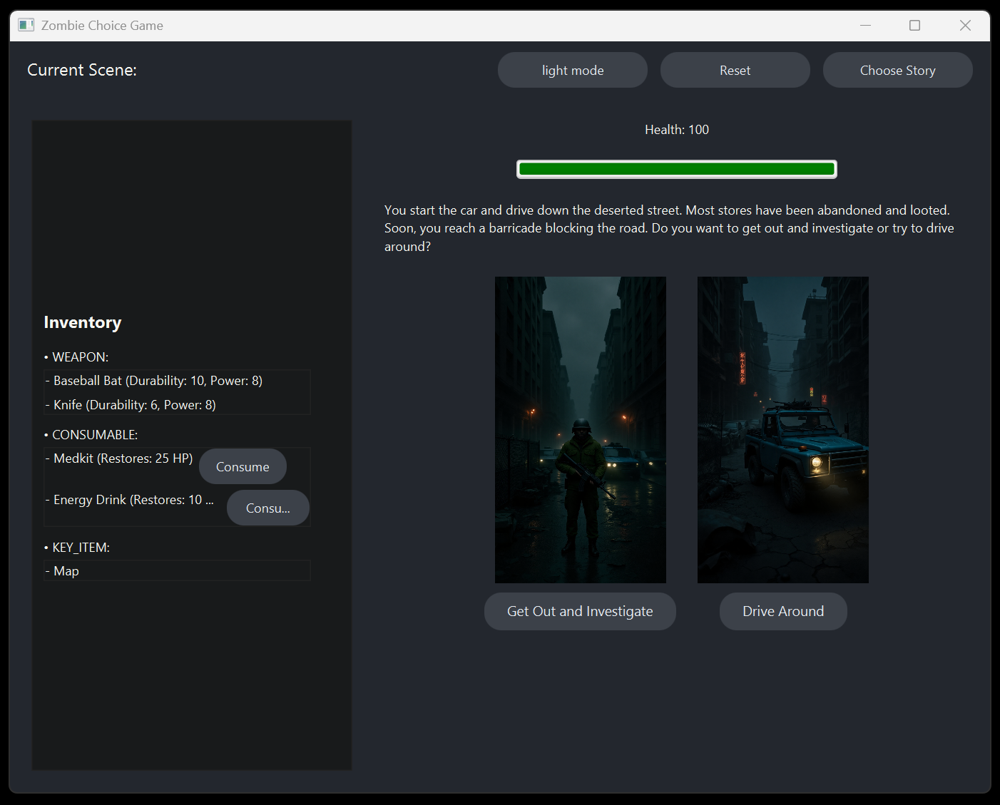
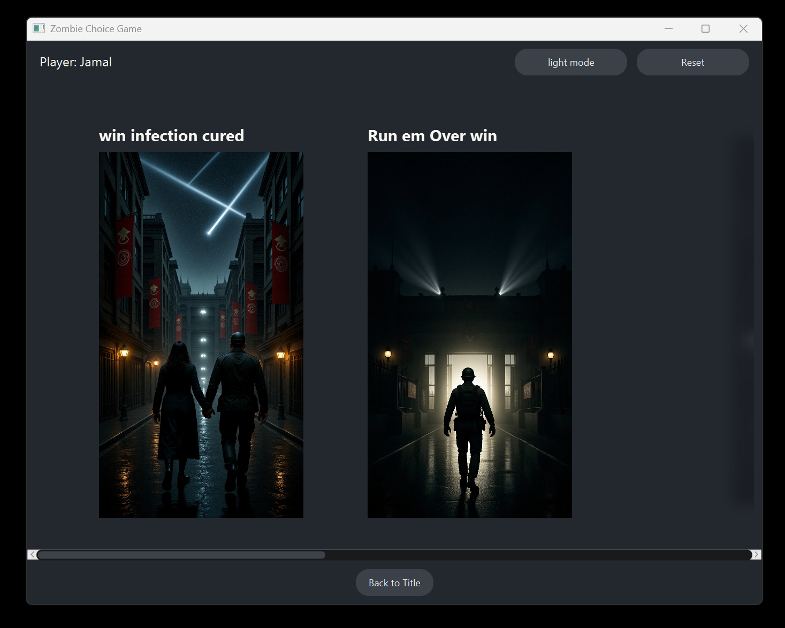

<div align="center">
  <h1>Zombie Choice Game</h1>
  <p><strong>A JavaFX survival narrative driven entirely by external JSON data.</strong></p>
  <p>Make choices, manage a fragile inventory, and survive—or get eaten. Every scene, item, and transition comes from JSON files.</p>

  <!-- Gameplay Video Link -->
  <p><strong>Gameplay Demo:</strong><br>
  <a href="https://youtu.be/zVVuPGwZjk0?si=paLymdgsn23uQ_OE" target="_blank">
    https://youtu.be/zVVuPGwZjk0?si=paLymdgsn23uQ_OE
  </a></p>
</div>

---

## Overview
Zombie Choice Game is a lightweight but fully engineered interactive fiction game built with Java + JavaFX.  
It uses **JSON files for all story, scene definitions, inventories, and saves**, and **Gson** as the JSON-parsing library.  
The project demonstrates clean MVC structure, a declarative content pipeline, and a simple state machine that drives the entire experience.

## UI Showcase

<p align="center">
  
  <br/>
  <em>Title Screen</em>
  </p>

<p align="center">
  
  <br/>
  <em>Story Selection Screen</em>
</p>

<p align="center">
  
  <br/>
  <em>Choice Screen with Dynamic Inventory + Threat Logic</em>
</p>

<p align="center">
  
  <br/>
  <em>Victory Screen with Save Slot Confirmation</em>
</p>

<p align="center">
  
  <br/>
  <em>Winning Photo Album (unlocked endings)</em>
</p>

## Highlights
- **Clean MVC:** model / view / controller separation.
- **JavaFX GUI:** modular views, dynamic scene construction, theme support.
- **State Machine:** a `GameState` enum controls screen flow and scene transitions.
- **JSON Content Pipeline:** all gameplay logic and story data are externalized in JSON.
- **Gson Integration:** Gson handles parsing and mapping JSON into model objects.
- **Inventory System:** item types, limits, power, durability, effects.
- **Threat & Combat Logic:** scene threat levels + weapon stats determine outcomes.
- **Persistent Saves:** three save slots stored as JSON in `src/data/saves/`.

---

 

## Feature Breakdown
### Choice-Driven Narrative
- Each scene loaded from JSON (`src/data/*.json`).
- Choices produce: next scene id, health deltas, item acquisition, or win/loss flags.
- Scene objects (`GameScene`) retain raw JSON for meta inspection.

### Inventory System
- `InventoryLoader` parses arrays of items and key item files.
- Item attributes: health restore, durability, power, type (`ItemType`).
- Logical limits (e.g., constrain weapon count) enforced in controller/model logic.
- Enables gating choices or mitigating damage.

### Threat & Combat Logic
- `threatLevel` per scene; player weapon power + threat influences outcomes (bitten / eaten flags).
- Durable weapons degrade via fights (`fightNumber`).
- Health changes aggregated per scene + choice effect.

### Save System
- `SaveManager` / `SaveData` implement three slot persistence under `src/data/saves/`.
- Slot JSON includes player status, progress markers (ending state), and inventory snapshot.
- Quick load on app start; manual overwrites on progression.

### Dynamic UI
- Views (`view/*View.java`) modular: Title, Instructions, ChoiceScreen, InventoryChoice, StoryTurnstile, WinningPhotoAlbum, TopBar.
- Consistent HUD with health & key items; theme (`Theme.java`) allows light/dark adjustments.

### JSON Content Pipeline
```
src/data/
  inventory.json
  health_inventory.json
  attack_inventory.json
  balanced_inventory.json
  antidote.json
  new_weapon.json
  titles.json
  drive_story1.json
  walk_story2.json
  saves/slot1.json .. slot3.json
```
Edit / add files → restart → new content live. No recompilation of logic layer required.

## JSON vs Gson (Clear Explanation)
To avoid confusion:

- **JSON** = the data format used for scenes, saves, titles, items, and story branching.
- **Gson** = the Java library used to parse those JSON files into Java objects.

Your game is JSON-driven, and uses Gson to read that JSON.

## Core Architecture
| Layer | Responsibilities | Key Classes |
|-------|------------------|-------------|
| Model | Domain, game state, inventory, scene graph | `GameScene`, `GameChoice`, `InventoryItem`, `InventoryLoader`, `SaveData`, `SaveManager`, `GameState`, `ItemType`, `SceneLoader`, `GameModel` |
| View  | JavaFX UI components & layout | `ChoiceScreenView`, `InventoryChoiceView`, `TitleView`, `InstructionsView`, `TopBarView`, `StoryTurnstileView`, `WinningPhotoAlbumView`, `Theme` |
| Controller | Orchestrates transitions, enforces rules, wires model↔view | `MainController` |

### State Flow
```
TITLE → INSTRUCTIONS → INTRO → FIRST_CHOICE → (SCENE ... SCENE) → ENDING (WIN / LOSS)
            │                                    │
            └─────────────── Save Slot Update ───┘
```

### Scene JSON Example
```jsonc
{
  "id": "drive_start",
  "prompt": "You wake up in a crashed car...",
  "imagePath": "imgs/crash.png",
  "threatLevel": 2,
  "choices": [
    { "label": "Grab weapon", "nextId": "grab_knife", "healthEffect": 0 },
    { "label": "Run", "nextId": "run_road", "healthEffect": -5 }
  ]
}
```
Parsed by loader classes → converted to `GameScene` + `GameChoice` objects → rendered by view layer → player picks → next scene fetched.

## Project Structure (Condensed)
```
src/
  Main.java                # Entry point
  controller/
    MainController.java    # Central orchestrator
  model/
    GameModel.java         # Aggregates & exposes runtime state
    GameScene.java         # Scene definition + threat/item logic
    GameChoice.java        # User-selectable branch item
    InventoryItem.java     # Item stats & effects
    InventoryLoader.java   # JSON parsing
    ItemType.java          # Enum categories
    SaveData.java          # Persistence DTO
    SaveManager.java       # Slot read/write
    SceneLoader.java       # Scene JSON parsing
    GameState.java         # Enum for UI/game phases
  view/
    ...View classes        # JavaFX modular screens
docs/                      # Deep-dive architecture & diagrams
imgs/                      # Visual assets
lib/                       # External jars (e.g., Gson)
```

## Running the Game
### Prerequisites
- JDK 17+ (LTS recommended)
- JavaFX SDK (matching OS & JDK)
- Gson (JSON parsing) → `lib/gson-2.10.1.jar`

### VS Code (Fast Path)
1. Open folder.
2. Install Java extensions when prompted.
3. Run `Main.java`.
4. If JavaFX errors: add VM args:
   ```
   --module-path "C:\path\to\javafx\lib" --add-modules javafx.controls,javafx.fxml,javafx.graphics
   ```

### PowerShell Manual Build
Download Gson (if absent):
```powershell
Invoke-WebRequest -Uri "https://repo1.maven.org/maven2/com/google/code/gson/gson/2.10.1/gson-2.10.1.jar" -OutFile "lib\gson-2.10.1.jar"
```
Compile:
```powershell
javac -d out -cp "src;lib\gson-2.10.1.jar" --module-path "C:\path\to\javafx\lib" --add-modules javafx.controls,javafx.fxml,javafx.graphics src\Main.java src\controller\*.java src\model\*.java src\view\*.java
```
Run:
```powershell
java -cp "out;lib\gson-2.10.1.jar" --module-path "C:\path\to\javafx\lib" --add-modules javafx.controls,javafx.fxml,javafx.graphics Main
```

## Documentation Set
- `ARCHITECTURE.md` – Deep overview & layering.
- `CLASS_DIAGRAM.md` – UML (Mermaid) relationships.
- `CLASS_REFERENCE.md` – Field & method catalogue.
- `GAMESTATE_DIAGRAM.md` – Progression & transitions.
- `GAMEPLAY_SEQUENCE.md` – Typical play loop & timing.

## Future Improvements
- Audio: ambient/hit SFX & adaptive soundtrack.
- Achievements & meta progression.
- Additional branching arcs (expansion packs JSON drop‑in).
- Animated transitions & tweened UI.
- Rich combat resolution (multiple weapon stats, evasion).
- Mobile-friendly layout & scaling.

## Contributing
Fork → feature branch → PR. Keep additions data‑driven where possible (prefer JSON over hardcoding). Maintain MVC boundaries.

## License
MIT License (or adapt as needed). Include a `LICENSE` file before distribution.

## Why This Matters
This repository demonstrates practical architecture decisions, clean separation of concerns, externalized content, and readable expansion points—exactly what an engineer needs to scale a narrative system without rewrites.

Enjoy surviving the outbreak.

---
> Built with JavaFX, Gson, and your choices.
