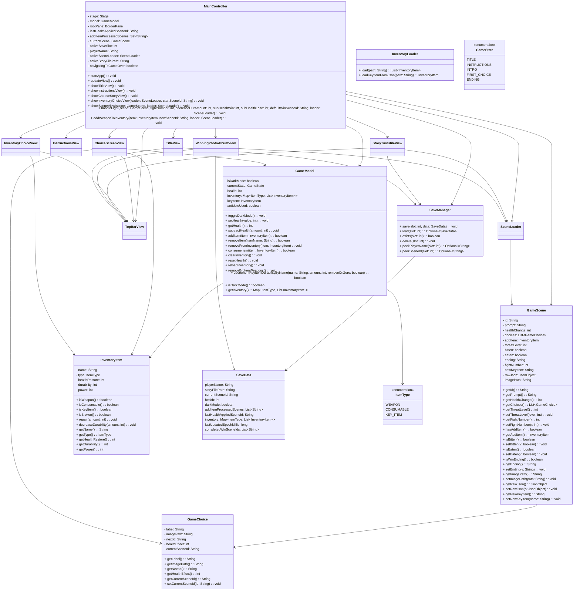

# Zombie Choice Game – Full Class Diagram

```mermaid
classDiagram
    %% ============================
    %% CONTROLLER LAYER
    %% ============================

    class MainController {
        - stage: Stage
        - model: GameModel
        - rootPane: BorderPane
        - lastHealthAppliedSceneId: String
        - addItemProcessedScenes: Set~String~
        - currentScene: GameScene
        - activeSaveSlot: int
        - playerName: String
        - activeSceneLoader: SceneLoader
        - activeStoryFilePath: String
        - navigatingToGameOver: boolean
        + startApp(): void
        + updateView(): void
        + showTitleView(): void
        + showInstructionsView(): void
        + showChooseStoryView(): void
        + showInventoryChoiceView(loader: SceneLoader, startSceneId: String): void
        + showSceneView(scene: GameScene, loader: SceneLoader): void
        + handleFight(scene: GameScene, fightNumber: int, decreaseDurAmount: int, subHealthWin: int, subHealthLose: int, defaultWinSceneId: String, loader: SceneLoader): void
        + addWeaponToInventory(item: InventoryItem, nextSceneId: String, loader: SceneLoader): void
    }

    %% ============================
    %% MODEL LAYER
    %% ============================

    class GameModel {
        - isDarkMode: boolean
        - currentState: GameState
        - health: int
        - inventory: Map~ItemType, List~InventoryItem~~
        - keyItem: InventoryItem
        - antidoteUsed: boolean
        + toggleDarkMode(): void
        + setHealth(value: int): void
        + getHealth(): int
        + subtractHealth(amount: int): void
        + addItem(item: InventoryItem): boolean
        + removeItem(itemName: String): boolean
        + removeFromInventory(item: InventoryItem): void
        + consumeItem(item: InventoryItem): boolean
        + clearInventory(): void
        + resetHealth(): void
        + reloadInventory(): void
        + removeBrokenWeapons(): void
        + decrementKeyItemDurabilityByName(name: String, amount: int, removeOnZero: boolean): boolean
        + isDarkMode(): boolean
        + getInventory(): Map~ItemType, List~InventoryItem~~
    }

    class GameScene {
        - id: String
        - prompt: String
        - healthChange: int
        - choices: List~GameChoice~
        - addItem: InventoryItem
        - threatLevel: int
        - bitten: boolean
        - eaten: boolean
        - ending: String
        - fightNumber: int
        - newKeyItem: String
        - rawJson: JsonObject
        - imagePath: String
        + getId(): String
        + getPrompt(): String
        + getHealthChange(): int
        + getChoices(): List~GameChoice~
        + getThreatLevel(): int
        + setThreatLevel(level: int): void
        + getFightNumber(): int
        + setFightNumber(n: int): void
        + hasAddItem(): boolean
        + getAddItem(): InventoryItem
        + isBitten(): boolean
        + setBitten(v: boolean): void
        + isEaten(): boolean
        + setEaten(v: boolean): void
        + isWinEnding(): boolean
        + getEnding(): String
        + setEnding(v: String): void
        + getImagePath(): String
        + setImagePath(path: String): void
        + getRawJson(): JsonObject
        + setRawJson(o: JsonObject): void
        + getNewKeyItem(): String
        + setNewKeyItem(name: String): void
    }

    class GameChoice {
        - label: String
        - imagePath: String
        - nextId: String
        - healthEffect: int
        - currentSceneId: String
        + getLabel(): String
        + getImagePath(): String
        + getNextId(): String
        + getHealthEffect(): int
        + getCurrentSceneId(): String
        + setCurrentSceneId(id: String): void
    }

    class InventoryItem {
        - name: String
        - type: ItemType
        - healthRestore: int
        - durability: int
        - power: int
        + isWeapon(): boolean
        + isConsumable(): boolean
        + isKeyItem(): boolean
        + isBroken(): boolean
        + repair(amount: int): void
        + decreaseDurability(amount: int): void
        + getName(): String
        + getType(): ItemType
        + getHealthRestore(): int
        + getDurability(): int
        + getPower(): int
    }

    class InventoryLoader {
        + load(path: String): List~InventoryItem~
        + loadKeyItemFromJson(path: String): InventoryItem
    }

    class SaveData {
        playerName: String
        storyFilePath: String
        currentSceneId: String
        health: int
        darkMode: boolean
        addItemProcessedScenes: List~String~
        lastHealthAppliedSceneId: String
        inventory: Map~ItemType, List~InventoryItem~~
        lastUpdatedEpochMillis: long
        completedWinSceneIds: List~String~
    }

    class SaveManager {
        + save(slot: int, data: SaveData): void
        + load(slot: int): Optional~SaveData~
        + exists(slot: int): boolean
        + delete(slot: int): void
        + peekPlayerName(slot: int): Optional~String~
        + peekSceneId(slot: int): Optional~String~
    }

    class GameState {
        <<enumeration>>
        TITLE
        INSTRUCTIONS
        INTRO
        FIRST_CHOICE
        ENDING
    }

    class ItemType {
        <<enumeration>>
        WEAPON
        CONSUMABLE
        KEY_ITEM
    }

    %% ============================
    %% VIEW LAYER
    %% ============================

    class TitleView
    class InstructionsView
    class StoryTurnstileView
    class InventoryChoiceView
    class ChoiceScreenView
    class WinningPhotoAlbumView
    class TopBarView

    %% ============================
    %% RELATIONSHIPS
    %% ============================

    MainController --> GameModel
    MainController --> SceneLoader
    MainController --> GameScene
    MainController --> SaveManager
    MainController --> WinningPhotoAlbumView
    MainController --> TopBarView
    MainController --> ChoiceScreenView
    MainController --> InventoryChoiceView
    MainController --> StoryTurnstileView
    MainController --> TitleView
    MainController --> InstructionsView

    GameModel --> InventoryItem
    GameModel --> ItemType
    GameScene --> GameChoice
    SceneLoader --> GameScene
    SaveManager --> SaveData
    ChoiceScreenView --> GameChoice
    ChoiceScreenView --> InventoryItem
    ChoiceScreenView --> GameModel
    ChoiceScreenView --> TopBarView
    InventoryChoiceView --> InventoryItem
    InventoryChoiceView --> TopBarView
    StoryTurnstileView --> SaveManager
    StoryTurnstileView --> TopBarView
    StoryTurnstileView --> SceneLoader
    WinningPhotoAlbumView --> SaveData
    WinningPhotoAlbumView --> SceneLoader
    WinningPhotoAlbumView --> TopBarView
    TitleView --> TopBarView
    TitleView --> SaveManager
```
