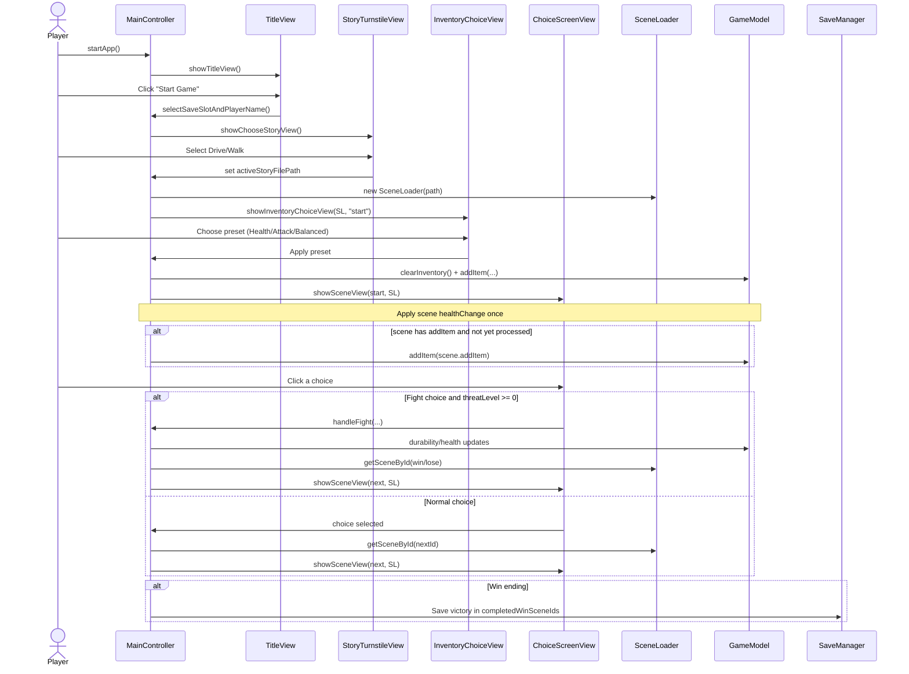

# Zombie Choice Game – Gameplay Sequence

This sequence diagram captures the primary gameplay flow from launch through story selection, inventory preset, choices (including combat), and win handling.

