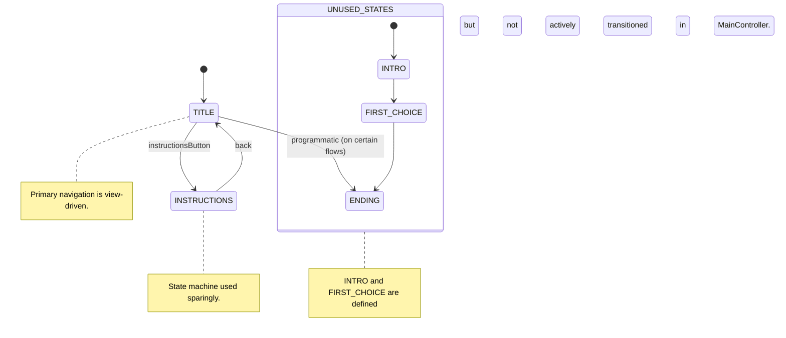

# Zombie Choice Game – GameState Diagram

This state machine diagram reflects the `model.GameState` enum and how the controller uses states today. Some enum values are defined but not actively transitioned in code.

